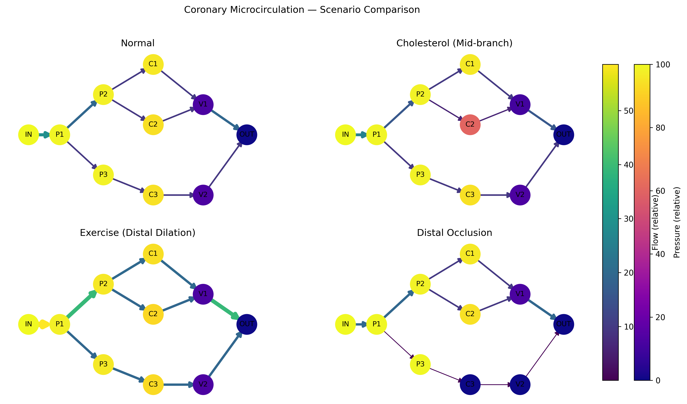

# Coronary Microcirculation Blood Flow Simulation

## Overview
This project models blood flow through a simplified coronary microvascular network using **Poiseuille’s law**, **Kirchhoff’s laws**, and **graph theory**.  
Multiple physiological and pathological scenarios are simulated, including:

- Healthy baseline flow  
- Mid-branch narrowing due to cholesterol buildup  
- Distal vasodilation during exercise  
- Severe distal occlusion  

The model solves for **node pressures** and **edge flows** in a multi-node vessel network and produces **shared-scale visualizations** for direct comparison across scenarios.

---------------------------------------------------------------------------------------------------------------------

## Key Features
- **Physics-based modeling**  
  Implements Poiseuille’s law with vessel-specific radii and lengths to calculate resistances.

- **Scenario analysis**  
  Four distinct physiological conditions simulated with adjusted vessel geometries.

- **Multi-scenario visualization**  
  4-panel figure with shared color scales for **flow** (edge width/color) and **pressure** (node color).

- **Quantitative outputs**  
  Prints node pressures, edge flows (μL/s), and total inflow/outflow for each scenario; includes % change vs. normal.

- **Data export**  
  Saves scenario comparison figures and per-edge flow data to CSV for further analysis.

---------------------------------------------------------------------------------------------------------------------

## Technical Approach

### Network Construction
The coronary-like vessel tree is represented as a **directed graph** (`networkx`), where:
- **Nodes** represent vessel junctions or measurement points.  
- **Edges** represent vessels with associated **length**, **radius**, and computed **resistance**.

### Flow Physics
Each vessel’s resistance is computed via Poiseuille’s law:  
`R = (8 * μ * L) / (π * r^4)`  
where `μ` is blood viscosity, `L` is length, and `r` is vessel radius.

### Pressure Solving
Kirchhoff’s current law (mass conservation) is applied at each node, and a linear system is solved for unknown pressures (`numpy.linalg.solve`).

### Flow Calculation
Edge flow is computed from pressure difference and resistance, converted to **μL/s** for readability:  
`Q_uL/s = (ΔP_Pa / R) * 1e9`

### Visualization
- **Edge width/color** → relative flow magnitude (Viridis colormap).  
- **Node color** → relative pressure (Plasma colormap).  
- **Shared scales** across scenarios enable direct visual comparison.  
- Optional **delta maps** show % change vs. normal (diverging colormap).

---------------------------------------------------------------------------------------------------------------------

## Scenarios Modeled
All four scenarios are modeled on the same coronary-like network:

1. **Normal** — Baseline geometry.  
2. **Exercise (Distal Vasodilation)** — 20% radius increase on distal microvessels.  
3. **Distal Occlusion** — 90% radius reduction on `P3 → C3`.  
4. **Cholesterol (Mid-branch Narrowing)** — 50% radius reduction on `P2 → C2`.

---------------------------------------------------------------------------------------------------------------------

## Outputs
**Console**
- Node pressures (mmHg)
- Edge flows (μL/s)
- Total inflow/outflow per scenario
- % change vs. normal totals

**Figures**
- Individual scenario plots
- 4-panel comparison figure with shared flow/pressure scales
- Optional delta maps (flow change vs. normal)

**Data**
- CSV with edge properties (length, radius, resistance, flow) per scenario

---------------------------------------------------------------------------------------------------------------------

## Example Figure

---------------------------------------------------------------------------------------------------------------------

## Technologies Used
- **Python 3.x**  
- **NumPy** — numerical computations & linear algebra  
- **NetworkX** — vascular network as a directed graph  
- **Matplotlib** — visualization & color mapping  
- **Pandas** — CSV export of results

---------------------------------------------------------------------------------------------------------------------

## Future Work

- Parameterization from patient-specific imaging (CT angiography, MRI)
- Non-Newtonian blood viscosity models
- Time-dependent simulations for pulsatile flow
- ML models to predict perfusion loss from vessel geometry

##Author

**Deniz Turk** — Biomedical Engineering student, University of South Carolina
Focused on computational modeling, data visualization, and applied physics in cardiovascular systems.
